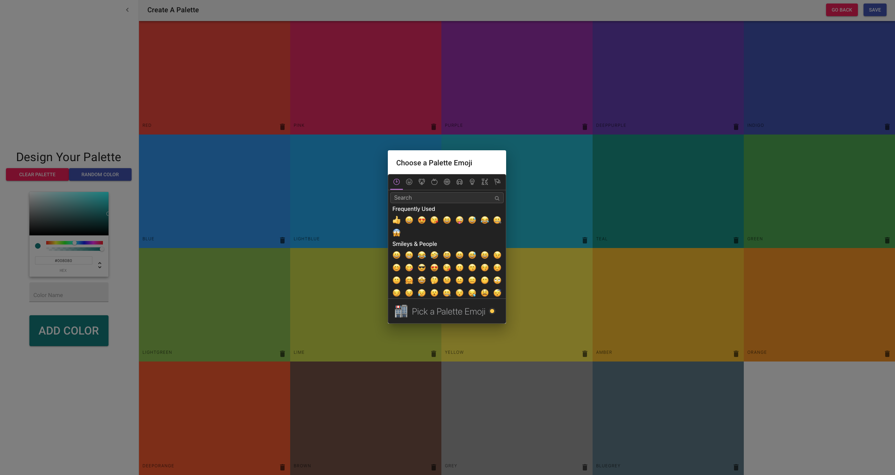

<h1>Palette</h1>

<p>When building websites or doing graphical design, you often need multiple colors that look great together. Palette is an app in which you can create color palettes that are perfect for your project.</p>

<h2>Features</h2>
<ul>
  <li>Create color palettes.</li>
  <li>Delete color palettes.</li>
  <li>Add colors in various formats (e.g., RGB, HEX) to a palette.</li>
  <li>Change color brightness levels.</li>
  <li>Look up similar colors to a specific color.</li>
  <li>Copy colors to clipboard.</li>
  <li>Change order of colors in a particular palette.</li>
</ul>

<table>
  <tr>
    <th>Main Menu</th>
    <th>Create Palette</th>
  </tr>
  <tr>
    <td></td>
    <td></td>
  </tr>
  <tr>
    <th>Copy Colors</th>
    <th>Add Emojis</th>
  </tr>
  <tr>
    <td></td>
    <td></td>
  </tr>
  <tr>
    <th>Mobile Menu</th>
    <th>Mobile Palette</th>
  </tr>
  <tr>
    <td></td>
    <td></td>
  </tr>
</table>

<h2>Tech Stack</h2>
<ul>
  <li>React</li>
  <li>Webpack</li>
  <li>Babel</li>
  <li>Node</li>
  <li>Material-UI</li>
  <li>Animations</li>
</ul>

<h2>Run Locally</h2>

```
git clone git@github.com:marcusvanwinden/palette.git
cd palette
yarn install
yarn start
```
